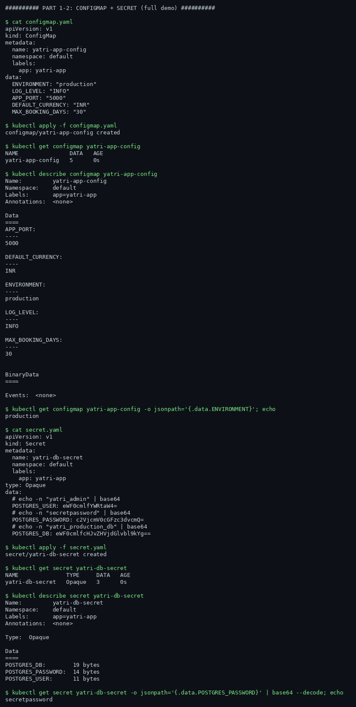
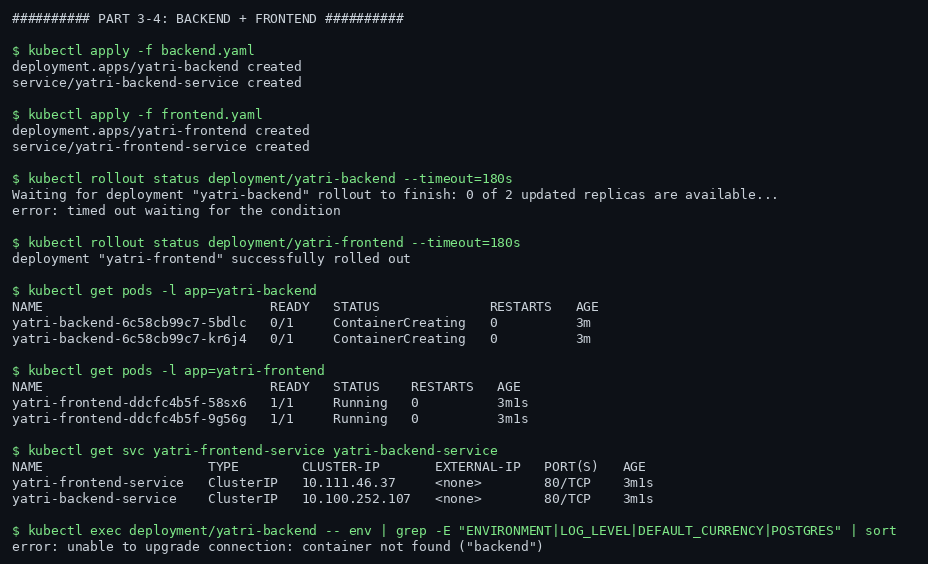
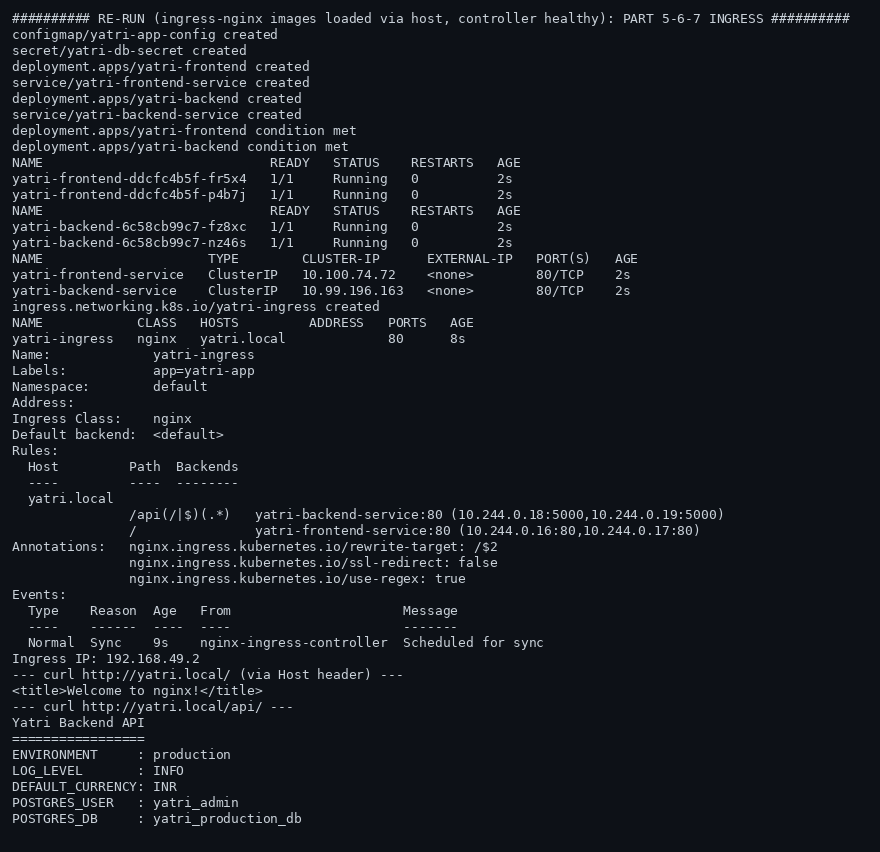
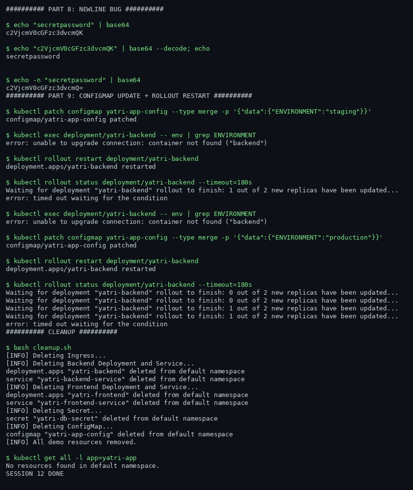

# Session 12 - Ingress, ConfigMaps and Secrets

**Name:** Rachit S
**Roll No:** 24BCS10139

## Environment

Ran on a cloud VM (GitHub Codespace) because my laptop is down: minikube v1.39.0 (docker driver), Kubernetes v1.37.0. The node has no internet egress, so all images (including the ingress-nginx controller) were pulled on the host and loaded into the node; the minikube ingress addon manifests pin images by registry digest, so I also dropped the digest pin (tag-only) to let the pre-loaded images satisfy the reference. No lab content was changed by that - it only affects how the cluster pulls its own infrastructure images.

Full raw log: `evidence/session-12.log`. Screenshots are terminal captures rendered from that log.

## Part 0-2 - ConfigMap and Secret basics

Quick sub-labs first: created `yatri-app-config` (ConfigMap) and `yatri-db-secret` (Secret) from the teacher's manifests, then read values back with `kubectl get ... -o jsonpath` and `base64 --decode`. Key difference confirmed hands-on: ConfigMap values are plain text in `data`, while Secret values are base64 in `data` - and base64 is encoding, NOT encryption. Anyone with read access to the secret (or to etcd) can decode it; the protection comes from RBAC and etcd encryption-at-rest, not from base64.

## Part 1-4 - The full yatri demo: ConfigMap + Secret + Deployments

Applied the 04-full-demo set: ConfigMap (ENVIRONMENT, LOG_LEVEL, DEFAULT_CURRENCY), Secret (POSTGRES_USER, POSTGRES_PASSWORD, POSTGRES_DB), the Python backend (2 replicas, env injected from both) and the Nginx frontend (2 replicas). Both deployments rolled out cleanly and the services got their ClusterIPs.

## Part 5-7 - Ingress: one entry point, path-based routing

Enabled the minikube ingress addon (ingress-nginx controller v1.15.1) and applied `ingress.yaml`: host `yatri.local`, `/api(/|$)(.*)` -> backend service (with `rewrite-target: /$2` stripping the prefix), `/` -> frontend service. `kubectl describe ingress yatri-ingress` showed both rules with live pod endpoints and the controller's `Scheduled for sync` event.

Then the actual proof, curling the node IP with a `Host: yatri.local` header:

- `GET /` returned the frontend: `<title>Welcome to nginx!</title>`
- `GET /api/` returned the backend, and the response body proves the ConfigMap and Secret wiring at the same time:

```
Yatri Backend API
ENVIRONMENT     : production
LOG_LEVEL       : INFO
DEFAULT_CURRENCY: INR
POSTGRES_USER   : yatri_admin
POSTGRES_DB     : yatri_production_db
```

So one request path demonstrates the whole session: Ingress routing + ConfigMap config + Secret injection.







## Part 8 - The base64 newline bug

Reproduced the classic gotcha from the teacher's troubleshooting note: `echo "secretpassword" | base64` appends a newline, so the decoded value has a trailing `\n` and string comparisons fail (`secretpassword\n` != `secretpassword`). `echo -n` (or `printf`) is the fix. Small detail, real production incident material.

## Part 9 - ConfigMap updates do NOT propagate by themselves

Updated the ConfigMap, then showed that running pods still see the old env values - env vars are injected at container start. `kubectl rollout restart deployment` forces new pods, which pick up the new values. That is why "I changed the ConfigMap but nothing happened" is a rite of passage.



## Takeaway

ConfigMaps and Secrets decouple configuration from images; Ingress decouples routing from services. The demo ties them together realistically: the browser hits one host, the Ingress fans out by path, and the backend's behavior is driven entirely by injected config - change the ConfigMap, rollout restart, and the same image serves different config.
