# Session 1 - DevOps Engineer Roadmap

**Name:** Rachit Suresh  
**Enrollment number:** 24BCS10139

## Work completed

These notes cover the DevOps roadmap discussed in class, including architecture choices, DevOps tools, networking, CI/CD, cloud platforms, containers, orchestration, monitoring, and infrastructure as code. The original notes are available in [`devops1-83.pdf`](../devops1-83.pdf).

## Screenshots

### Page 1

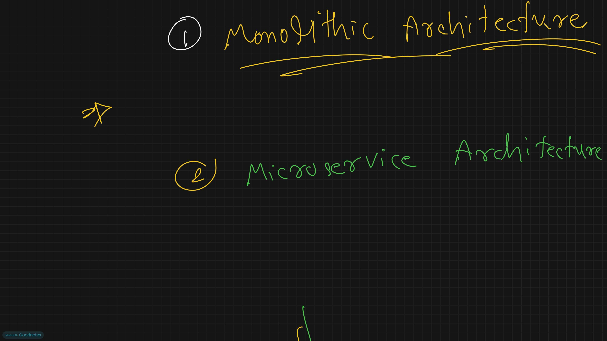

### Page 2

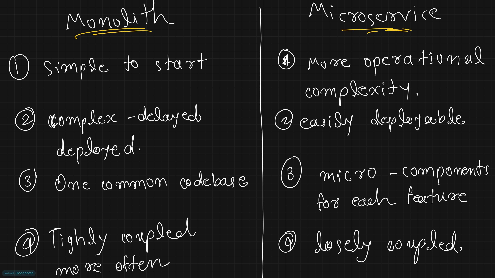

### Page 3

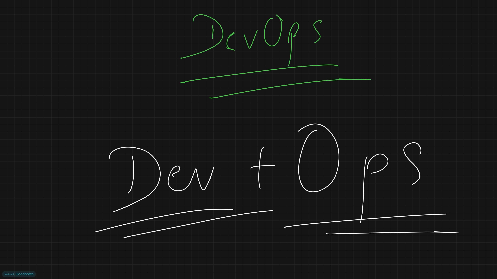

### Page 4

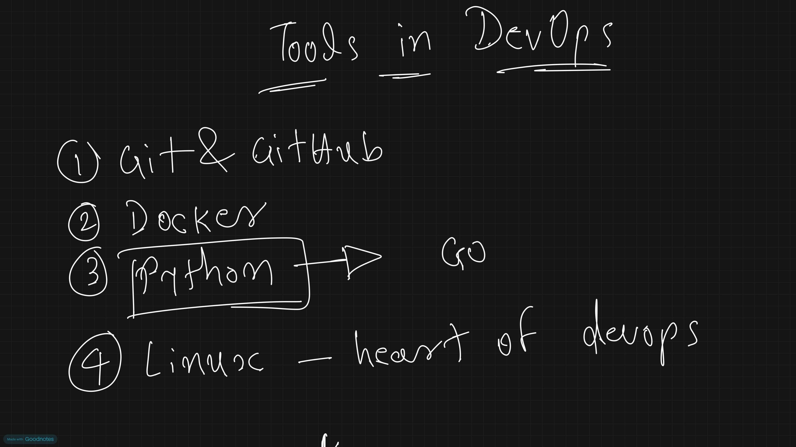

### Page 5

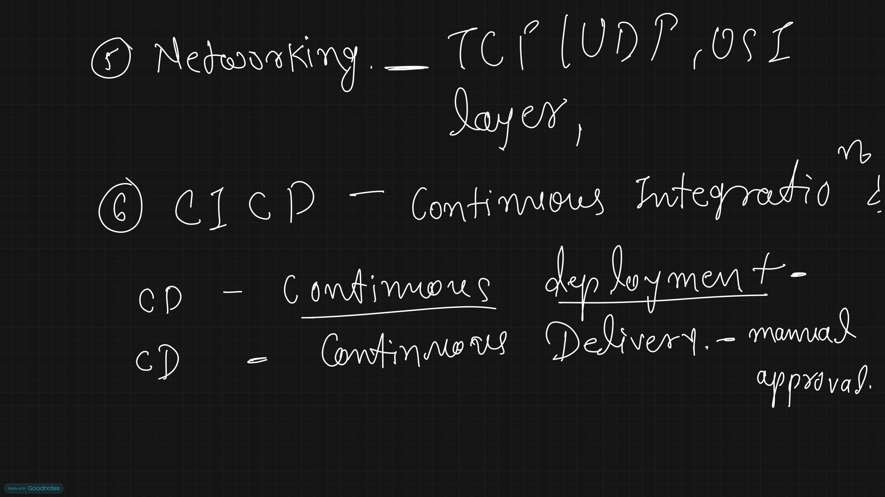

### Page 6

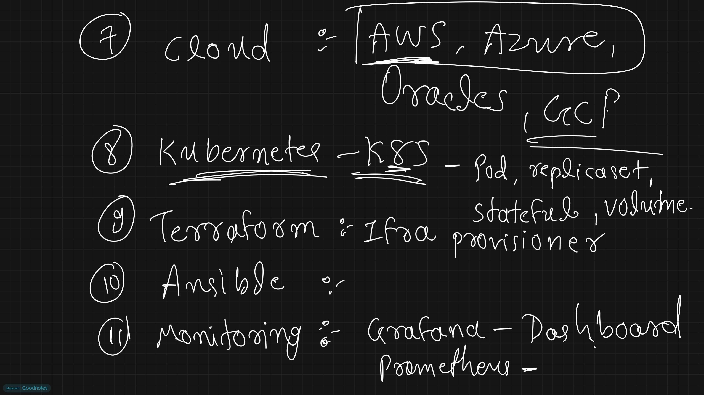

### Page 7

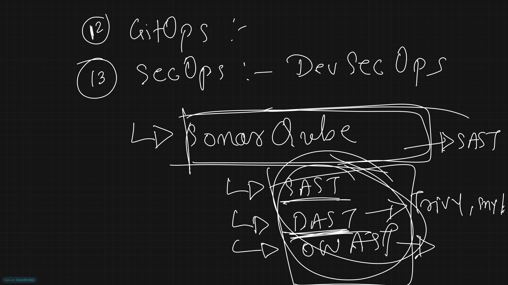

### Page 8

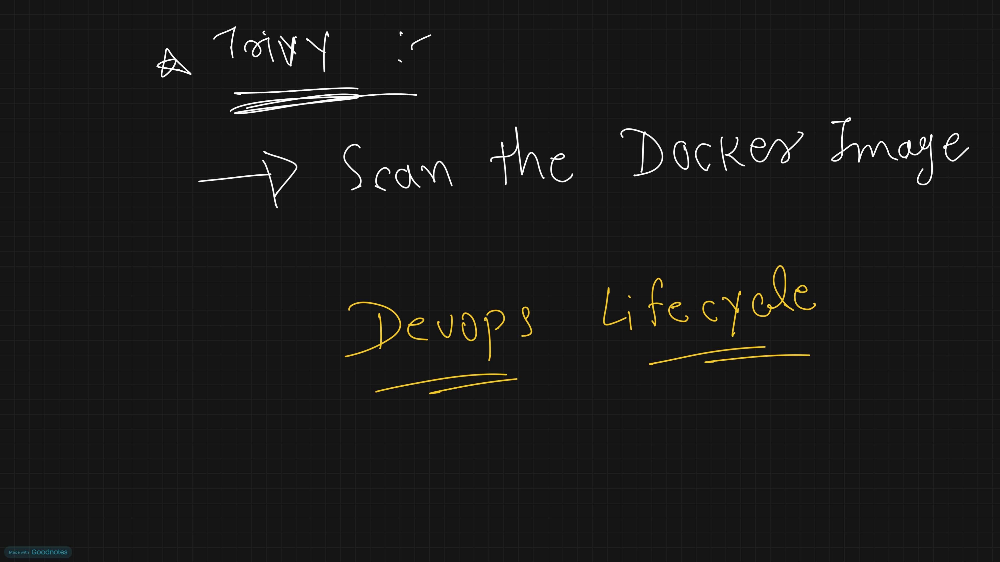

### Page 9

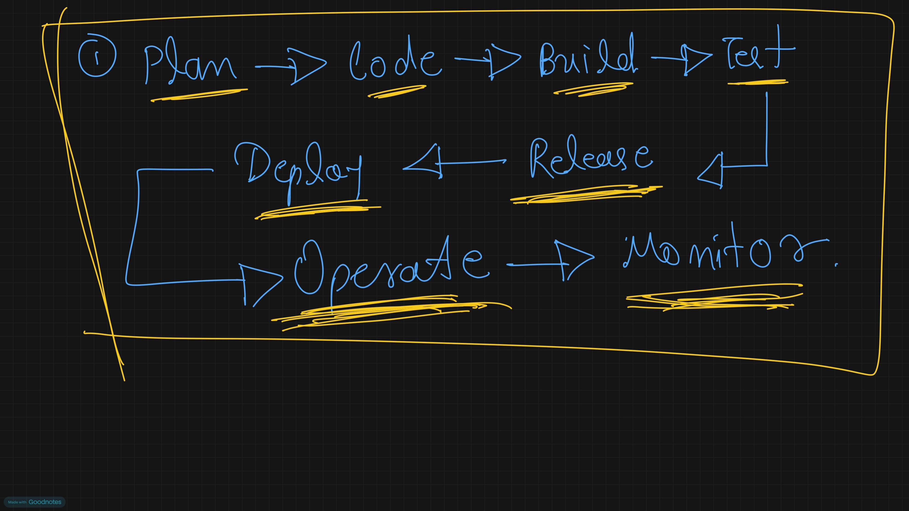

### Page 10

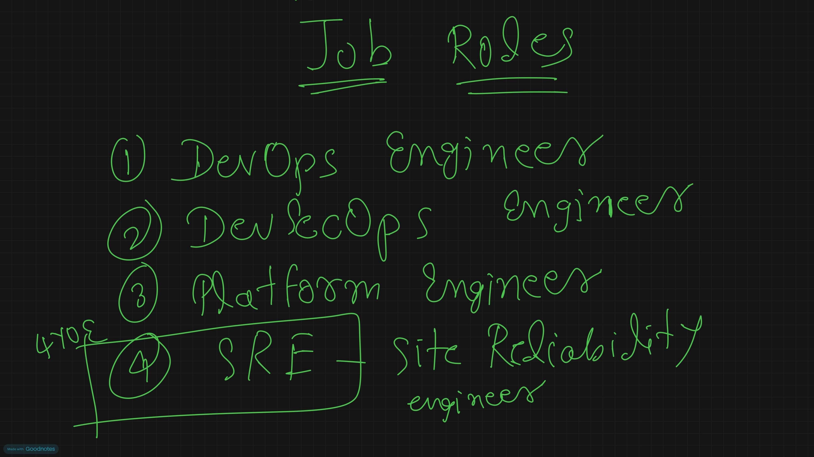

### Page 11

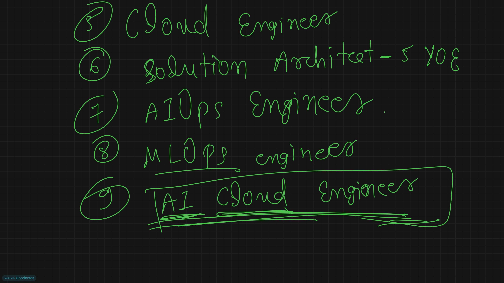

### Page 12

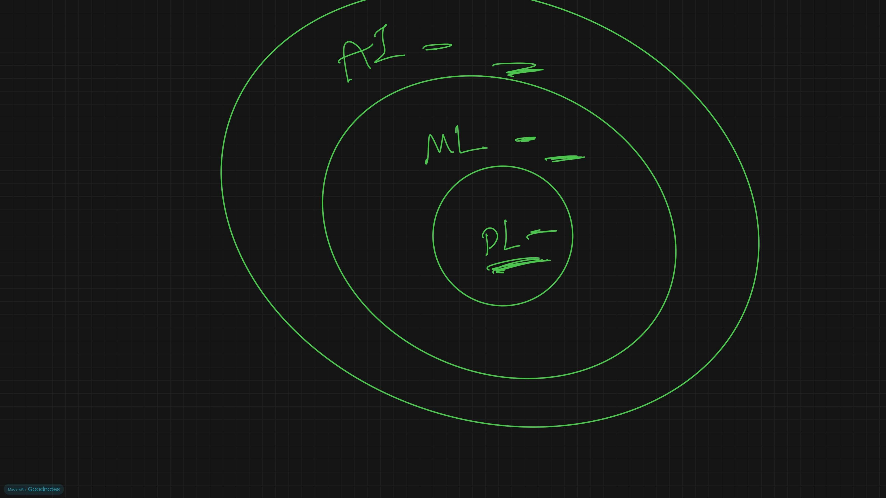

### Page 13

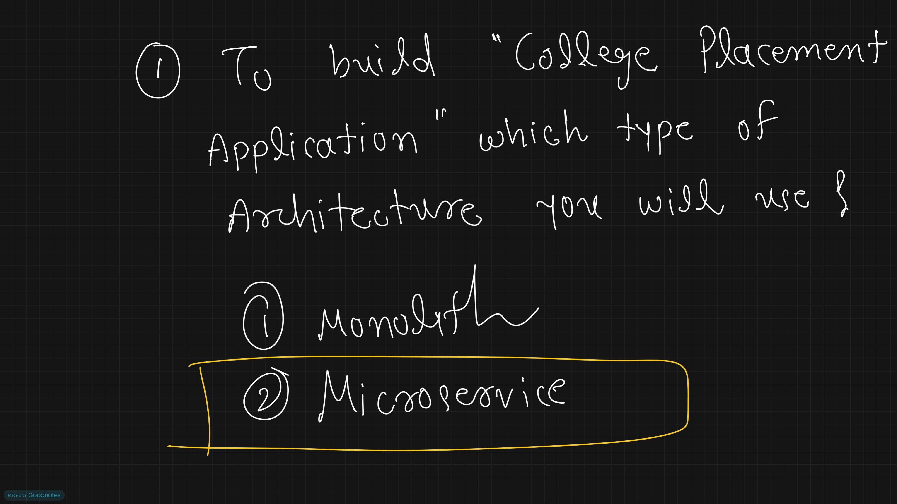
