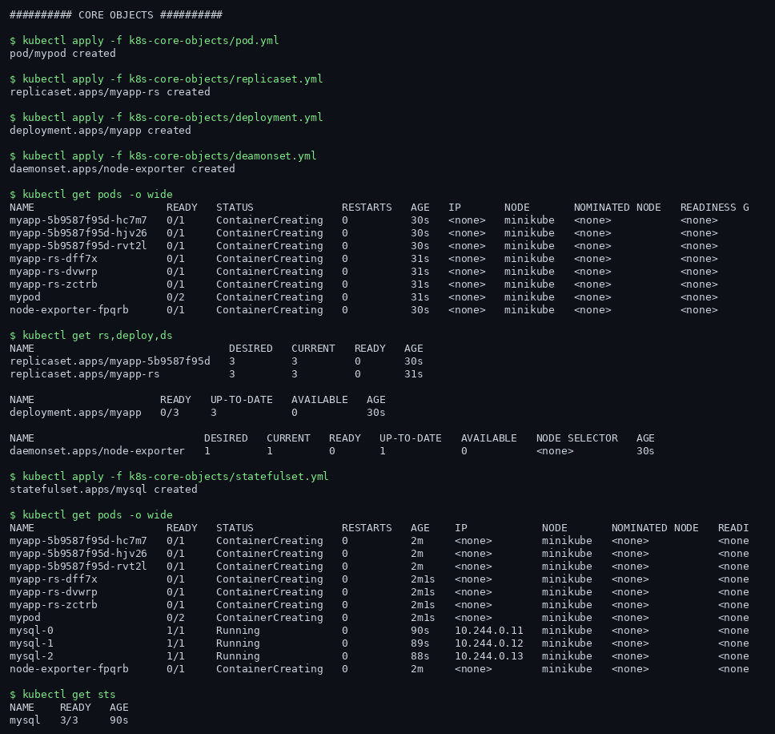
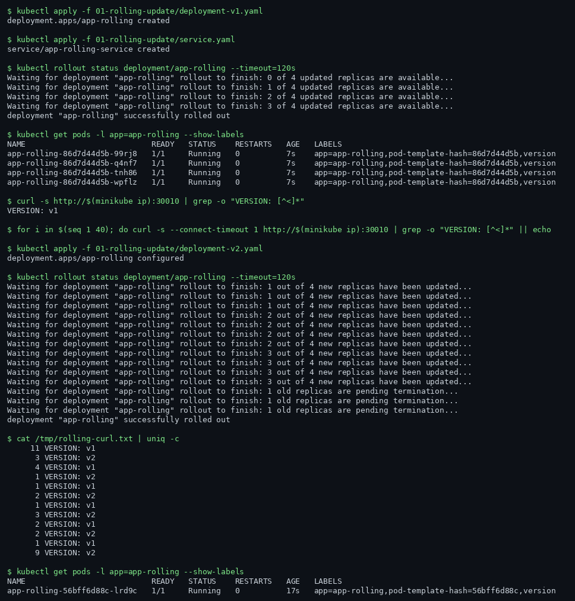
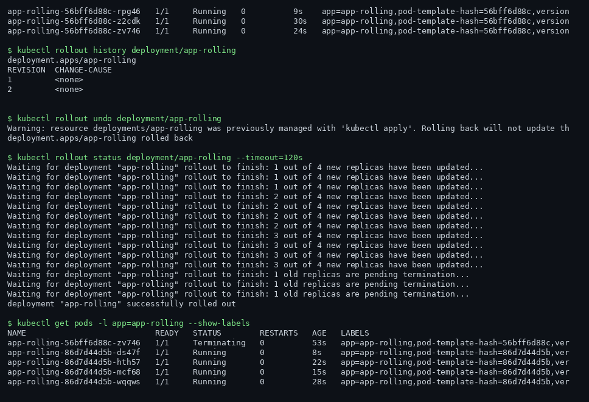
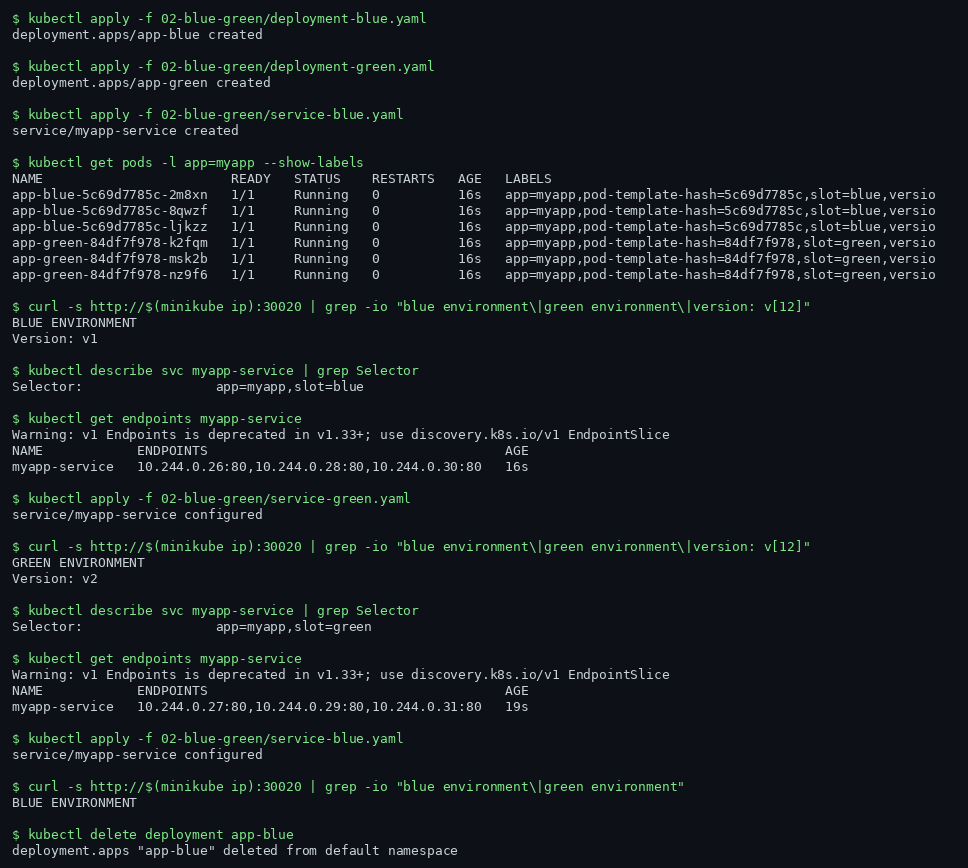
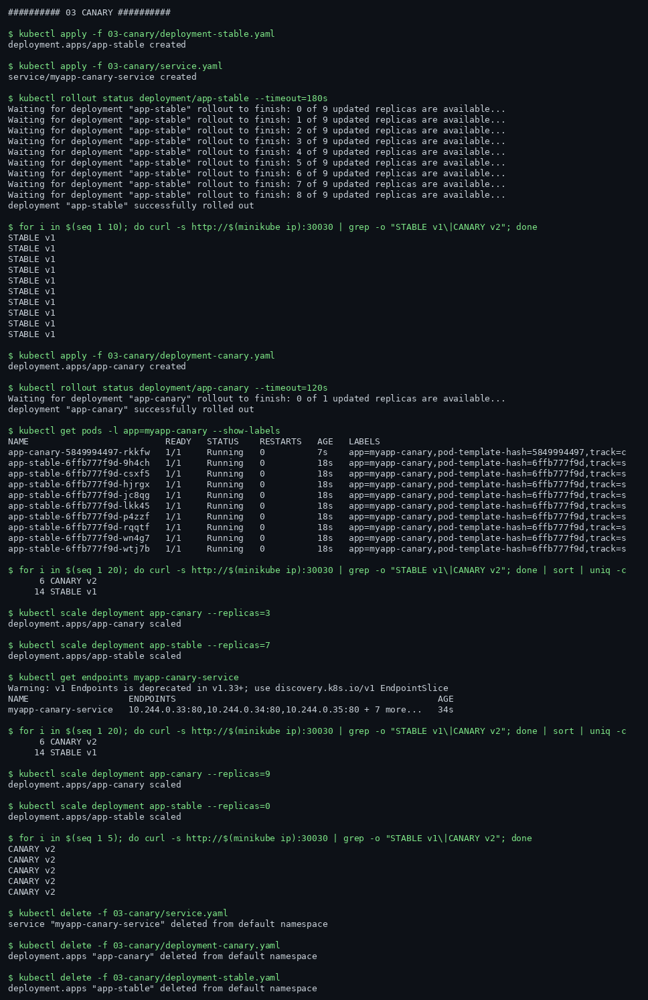
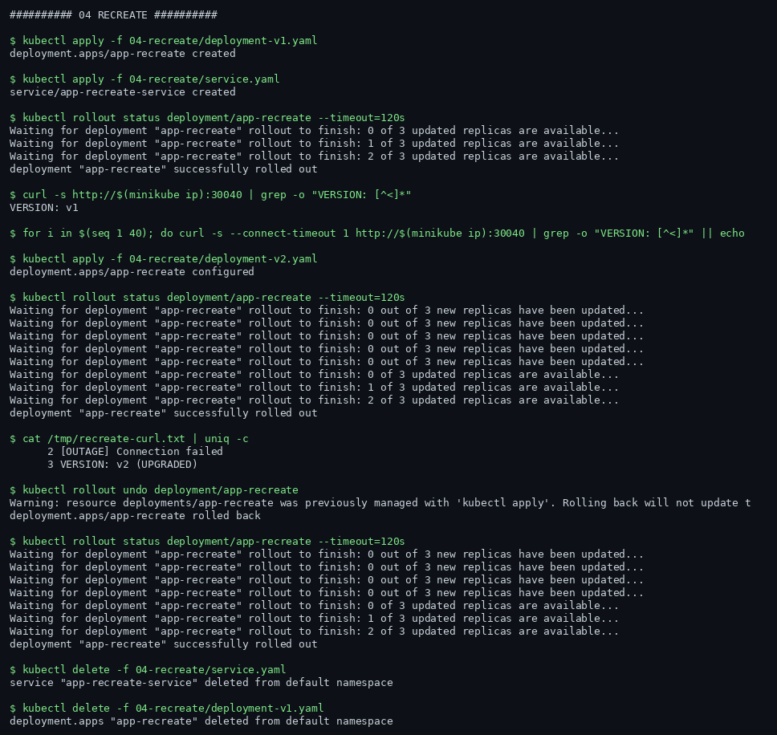
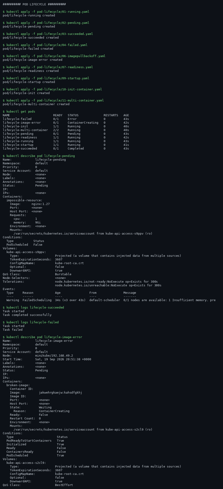

# Session 10 - Kubernetes Core Objects and Deployment Strategies

**Name:** Rachit S
**Roll No:** 24BCS10139

## Environment

My laptop is not working, so I ran this lab on a cloud VM (GitHub Codespace, 4 vCPU / 16 GB) instead of locally:

- minikube v1.39.0 with the docker driver
- Kubernetes v1.37.0, single node cluster
- One quirk of this setup: the minikube node cannot resolve external DNS, so every container image was pulled on the VM host and loaded into the node with `minikube image load` before use.

All commands and outputs below are from my actual run. The full raw log is in `evidence/session-10.log`, and the `Screenshots/` folder holds the key terminal captures (rendered from the same log, since the lab ran on a headless VM).

## Part 1 - Core Objects (pod, replicaset, deployment, daemonset, statefulset)

Applied the teacher's manifests from `k8s-core-objects/` one by one, then inspected what the scheduler did.

- **Pod** is the smallest deployable unit: one or more containers sharing network and storage. Created alone, it is not restarted or rescheduled by anything if it dies.
- **ReplicaSet** keeps N identical pods running. I saw it own the pod names (`<rs-name>-<random>` suffix). Deleting a pod makes the ReplicaSet recreate it immediately - that reconciliation loop is the whole point.
- **Deployment** wraps a ReplicaSet and adds rollout management (history, revision tracking, rolling updates). In practice you almost never create a ReplicaSet directly; the Deployment creates and versions them for you.
- **DaemonSet** runs exactly one pod per node. On my single-node cluster I got one pod; on a multi-node cluster every node would get its own copy (used for log agents, monitoring, etc.).
- **StatefulSet** is for stateful workloads. Unlike a Deployment, pods get stable, ordered names (`mysql-0`, `mysql-1`, ...) and stable network identity. `kubectl describe sts mysql` showed `podManagementPolicy: OrderedReady` and the PVC template - each pod keeps its own storage across restarts.

## Part 2 - Deployment Strategies

### Rolling update (zero downtime)

I deployed v1 of the app behind a NodePort service, started a background loop curling the service every 0.5s, then applied v2. The loop output counted with `uniq -c` shows responses kept coming through the whole rollout - first all v1, then a mix while pods were replaced one at a time, then all v2. No `[no response]` lines, which is the zero-downtime proof.

`kubectl rollout history` showed both revisions, and `kubectl rollout undo` took the Deployment back to v1 cleanly. Rolling update works because the Deployment scales the new ReplicaSet up and the old one down gradually (maxSurge/maxUnavailable), so the Service always has ready endpoints.

### Blue-green

Two full environments exist at once: `myapp-blue` (v1) and `myapp-green` (v2), both running. The Service selects `version: blue` initially, so all traffic hits blue. The switch is a one-line change to the Service selector (`version: green`) - I watched `kubectl get endpoints` change from the blue pod IPs to the green ones, and the next curl returned the green response. Rollback is just flipping the selector back, which I also did. The cost is running double capacity during the cutover.

### Canary

Instead of switching everyone at once, canary sends a small slice of traffic to the new version. With 9 stable pods and 1 canary pod behind the same Service (roughly 10%), a 40-request curl loop hit the canary version only a few times. Scaling the canary to 3 out of 10 moved it to about 30% (6 of 20 requests in my sample), and promoting to 100% is just replacing the stable deployment. Kubernetes Services do not do weighted traffic splitting natively - the ratio comes from pod counts, which is why this is the simple-but-coarse version of canary.

### Recreate

Recreate kills every old pod first, then starts the new ones. The curl loop during the recreate showed `[no response]` for several seconds - a real, visible outage window. It is the simplest strategy and fine for dev or when the app cannot run two versions at once, but the downtime is why production systems avoid it.

## Part 3 - Pod Lifecycle

Ran the teacher's `pod-lifecycle/` manifests to observe every phase and hook:

- **Pending** - I could even force it: a pod asking for huge memory stayed Pending with `FailedScheduling` (`Insufficient memory`) in its events.
- **Running / Succeeded** - a job-style pod ran to completion (`Completed` phase, exit 0, logs readable afterwards).
- **Failed** - a pod whose container exits non-zero lands in `Error`/`Failed` and stays for inspection.
- **CrashLoopBackOff** - a container that exits immediately gets restarted with exponential backoff (restarts count climbs: 1, 2, 3...).
- **ImagePullBackOff** - a pod referencing a non-existent image tag never starts; events show the pull failing repeatedly.
- **Probes** - liveness kills and restarts a container that stops answering; readiness controls whether the pod receives Service traffic at all (an unready pod drops out of endpoints but is not restarted).
- **Init containers** run to completion before the main container starts - visible in `kubectl get` as `Init:0/1` then `PodInitializing` then `Running`.
- **Multi-container pod** - two containers in one pod share localhost; the sidecar pattern in miniature.
- **Graceful termination** - on delete, the pod goes `Terminating`, gets SIGTERM, then SIGKILL after `terminationGracePeriodSeconds` if it ignores it.

## What I took away

Deployments are the default for stateless apps because rollout management is built in; StatefulSets exist for identity + storage; DaemonSets for per-node agents. Of the four strategies, rolling is the practical default, blue-green is the safest cutover if you can afford double capacity, canary is best for risky releases, and recreate trades downtime for simplicity. Watching the curl loops during each strategy made the differences concrete in a way the YAML alone does not.
