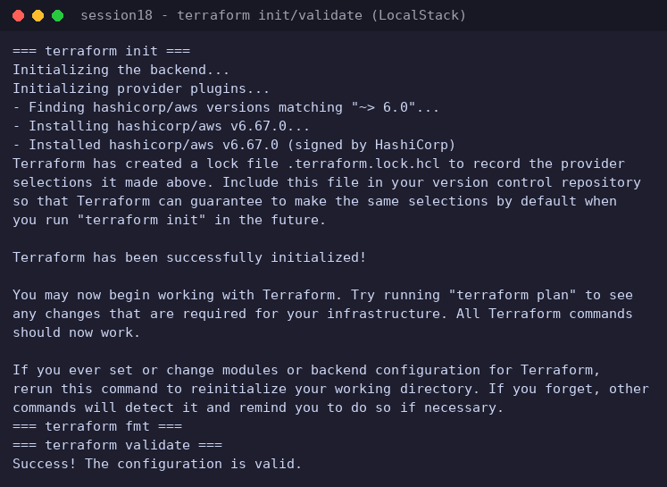
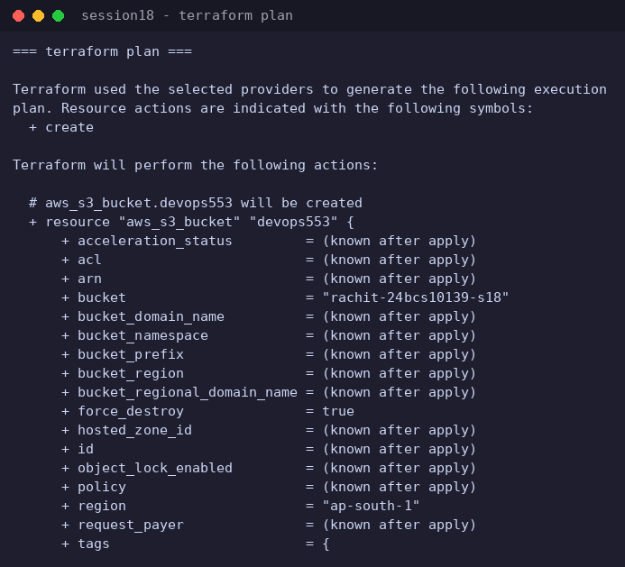
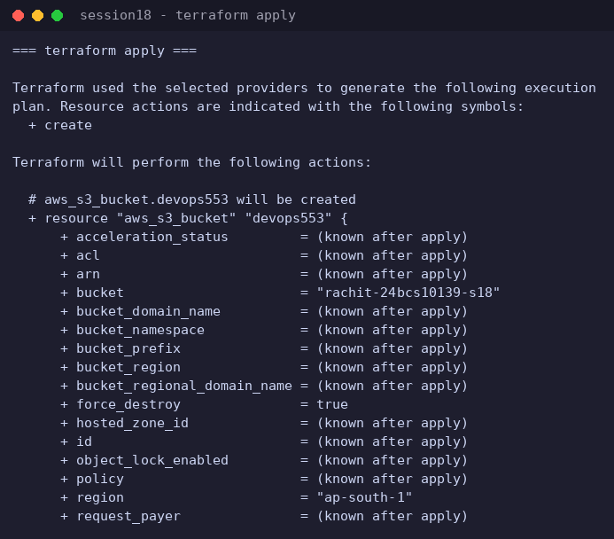
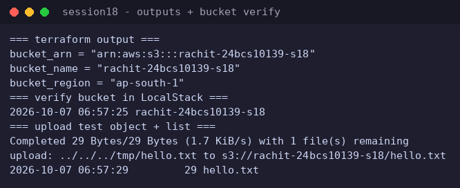

# Session 18 - Terraform S3 Demo (Rachit, 24BCS10139)

Ran the official `terraform-s3-demo` against LocalStack (local AWS emulation) inside a GitHub Codespace. Per my choice, LocalStack replaces a real AWS account for this lab; the Terraform workflow (init/fmt/validate/plan/apply/output/verify) is identical.

## Changes vs the official lab files (in `terraform/`)
- `providers.tf` points the AWS provider at LocalStack (`http://localhost:4566`, dummy credentials, s3 path style) instead of real AWS.
- Bucket name set to `rachit-24bcs10139-s18`.
- The official `outputs.tf` used `type = string` inside output blocks, which current Terraform rejects ("An argument named \"type\" is not expected here"); those three lines were removed. Nothing else changed.

## Results
- `terraform validate` -> "Success! The configuration is valid."
- `terraform plan` -> 1 to add (aws_s3_bucket.devops553).
- `terraform apply` -> "Apply complete! Resources: 1 added, 0 changed, 0 destroyed."
- Outputs: bucket_name = rachit-24bcs10139-s18, bucket_arn = arn:aws:s3:::rachit-24bcs10139-s18, region ap-south-1.
- Verified inside LocalStack: `awslocal s3 ls` shows the bucket; uploaded `hello.txt` and listed it in the bucket.

## Screenshots
### init (aws provider v6.67.0) + validate

### plan

### apply complete

### outputs + bucket/object verification

## Evidence
- `evidence/session-18.log` - full terminal capture
- `terraform/` - the exact configuration applied
