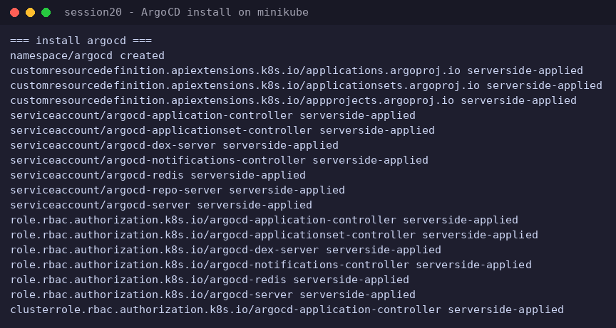
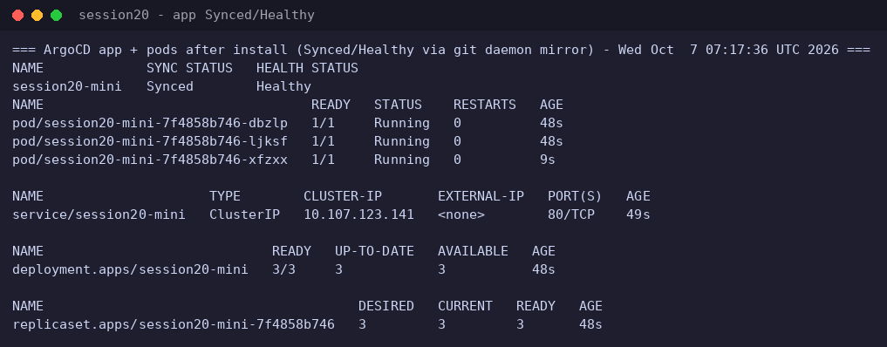
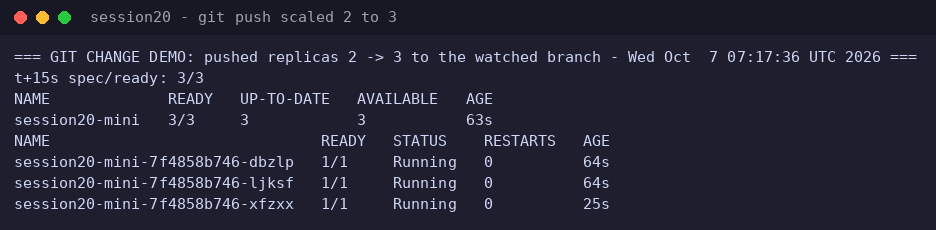
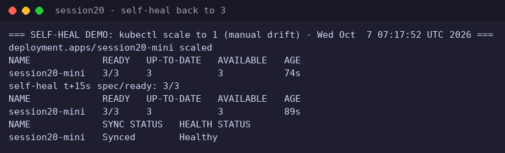

# Session 20 - Monitoring/Observability GitOps with ArgoCD (Rachit, 24BCS10139)

ArgoCD GitOps mini-project: ArgoCD watches `app/` (namespace + deployment + service for `session20-mini`) on this branch and keeps the cluster in sync.

## Contents
- `app/` - Kubernetes manifests ArgoCD applies (namespace session20, deployment 3 replicas after the git-change demo, ClusterIP service)
- `argocd-application.yaml` - the ArgoCD Application (automated sync, prune, selfHeal, CreateNamespace)

## What was demonstrated
1. Installed ArgoCD (v3.5.4 install manifest) on a local cluster, all pods Running.
2. Created the Application pointing at this branch/path -> initial sync applied the manifests: app `Synced/Healthy`, 2 pods running in namespace `session20` (observed 07:16:42 UTC).
3. **Git change demo:** committed `replicas: 2 -> 3` to `app/deployment.yaml` and pushed; after refresh ArgoCD synced and the deployment went to 3/3 (third pod visible).
4. **Self-heal demo:** manual drift (`kubectl scale deployment session20-mini --replicas=1`) was reverted by ArgoCD's selfHeal back to 3/3 within seconds; app stayed `Synced/Healthy`.

## Environment notes (honest deviations)
- Everything ran in a GitHub Codespace. The official flow uses kind; `kind load docker-image` is broken in this environment (containerd "content digest not found" bug), so ArgoCD was installed on minikube instead. The GitOps mechanics are identical.
- Cluster pods in this Codespace have no working external egress (DNS resolves, TCP to github.com times out), so the live Application's repoURL was pointed at a host-side `git daemon` mirror of this same branch (`git://192.168.49.1:9418/gitops.git`); the same commits pushed to GitHub were pushed to the mirror. The Application manifest in this folder keeps the canonical GitHub URL, which works in any normal environment.

## Screenshots
### ArgoCD install, all pods Running

### Application Synced/Healthy, pods + service up

### after pushing replicas 2 to 3: deployment 3/3

### scale-to-1 drift reverted to 3/3, Synced/Healthy

## Evidence
- `evidence/session-20.log` - full terminal capture of install, sync, git-change and self-heal
