# Session 21 - Capstone Integration: TaskBoard Full-Stack Pipeline
## Rachit - 24BCS10139

This session runs ma'am's TaskBoard reference project (`session21-python/`) end to end: local compose, CI/CD, container registry, terraform, Kubernetes + Helm, ingress, HPA, monitoring, and failure troubleshooting. Everything below was executed for real in a GitHub Codespace on my fork; raw captured output is in `evidence/session-21-taskboard-clean.log` and terminal screenshots in `Screenshots/`.

## PART O - Final Demo checklist (15 items)

| # | Item | Where it ran | Evidence |
|---|------|--------------|----------|
| 1 | Application: open TaskBoard + create a task | docker compose (backend :8000, frontend :3000, postgres :5432) | `01-app-crud.png` |
| 2 | API: FastAPI `/docs` + CRUD | `/docs` served; CRUD exercised through the same OpenAPI endpoints with correct enums (LOW/MEDIUM/HIGH, TODO/IN_PROGRESS/DONE) | `01-app-crud.png` |
| 3 | Database: PostgreSQL `tasks` table | `psql` select inside the postgres container | `02-database.png` |
| 4 | Git: small change + commit | `index.html` title personalized (commit `935a484`) | `11-git-ci.png` |
| 5 | CI: push shows tests running | GitHub Actions run `37596576185` - pytest 3/3, frontend build, docker build+scan+push all green | `12-ci-trivy-ghcr.png`, run URL below |
| 6 | Docker: the two images | `taskboard-backend:local`, `taskboard-frontend:local` built locally | `03-docker-images.png` |
| 7 | Security: Trivy scans | `trivy-action` scans backend + frontend (HIGH,CRITICAL) in CI | `12-ci-trivy-ghcr.png` |
| 8 | Registry: images in GHCR | CI pushes `ghcr.io/rachit-suresh/taskboard-{backend,frontend}:<sha>` | `12-ci-trivy-ghcr.png` |
| 9 | Terraform: AWS infra code | VPC (2 AZ) + EKS modules; `validate` Success, `plan` = 54 to add against LocalStack | `04-terraform.png` |
| 10 | Kubernetes: pods + svc | `kubectl get pods/svc -n taskboard` - frontend, backend, postgres all Running | `05-k8s-helm.png` |
| 11 | Helm | `helm list -n taskboard` - release `taskboard` deployed | `05-k8s-helm.png` |
| 12 | Ingress: open app via hostname | `taskboard.local` through ingress-nginx (health, create task, list, stats) | `06-ingress.png` |
| 13 | HPA | in-cluster fortio load (64 conn, max qps): 43,057 calls 100% HTTP 200, CPU 2% -> 496%/60%, replicas 2 -> 6 | `07-hpa-scale.png` |
| 14 | Monitoring: Prometheus + Grafana | both Running in ns `monitoring`; targets up incl. `taskboard-backend`; `http_requests_total` = 22,144 scraped; Grafana `/api/health` ok | `09-monitoring.png`, `10-app-scrape.png` |
| 15 | Failure simulation | broken-image lab (ImagePullBackOff diagnosed + fixed) and broken-service lab (empty endpoints diagnosed + selector fixed) | `08-troubleshooting.png` |

## Links

- Branch: https://github.com/rachit-suresh/devops-heros/tree/session-21-taskboard-demo-rachit-24bcs10139
- CI run (small-change push, green): https://github.com/rachit-suresh/devops-heros/actions/runs/37596576185
- CI run (test-fix push, green): https://github.com/rachit-suresh/devops-heros/actions/runs/37589014626

## Bugs in the reference project I had to fix (documented, committed)

1. `backend` tests: `TestClient` used without a context manager, so startup (table creation) never ran and tests failed. Fixed in `45e2321` - pytest 3/3 green.
2. `terraform/*.tf` were minified single-line blocks - invalid HCL, `terraform validate` rejected them; `versions.tf` also declared a duplicate `provider "aws"`. Reformatted to multi-line blocks, single provider in `providers.tf` (commit `db8e731`). After the fix: `validate` = Success, `plan` = 54 to add, 0 to destroy.
3. Frontend `nginx.conf` proxies to upstream `backend` (compose DNS name). In Kubernetes the backend Service is `taskboard-taskboard-backend`, so nginx crashed with `host not found in upstream`. Fixed with a `backend` Service alias (ClusterIP -> backend pods :8000).
4. Helm chart ingress template points at Service `taskboard-backend:8080`, which does not exist (the chart's backend Service is `taskboard-taskboard-backend:8000`). Fixed with a `taskboard-backend:8080 -> :8000` Service alias; ingress then serves `/api` correctly.
5. CI workflow: replaced ma'am's Docker Hub push with GHCR + `GITHUB_TOKEN`, and pinned `trivy-action` to a full version tag.

## Honest environment deviations (Codespace networking limits)

- **minikube instead of kind/EKS**: Kubernetes runs on minikube in the Codespace; terraform plans target LocalStack (per my approval earlier today) instead of a real AWS account, so no EKS console screenshots exist.
- **Ingress**: reached via `minikube ip` NodePort 31432 with `Host: taskboard.local` header (docker-driver minikube does not bind port 80 on the host).
- **Ingress controller images**: node image pulls are blocked in Codespaces, so `ingress-nginx/controller` + `kube-webhook-certgen` were pulled on the host and loaded with `minikube image load`; the digest-pinned pod specs were re-pointed at the local tags.
- **HPA load**: ma'am's `scripts/load-test.sh` (500 sequential curls at fortio's 8 qps default) could not move CPU past ~25%; the real load was generated in-cluster with fortio at max qps against the ClusterIP, which scaled the HPA 2 -> 6.
- **Prometheus**: installed the plain `prometheus-community/prometheus` chart. The repo's `prometheus-values.yaml` is written for kube-prometheus-stack (ServiceMonitor CRDs), so a `taskboard-backend` scrape job was added via `extraScrapeConfigs` instead. The config-reloader sidecar would not resolve its image inside the Codespace and was disabled via helm values; everything else runs stock.
- **Grafana persistence** is disabled by default (helm warning) - fine for a class demo.

## Repo layout for this submission

```
session21-python/Rachit-24bcs10139/
  README.md                        <- this file
  Screenshots/                     <- terminal PNGs, one per demo item group
  evidence/session-21-taskboard-clean.log  <- full captured run log
```

## Screenshots

### Application and API CRUD

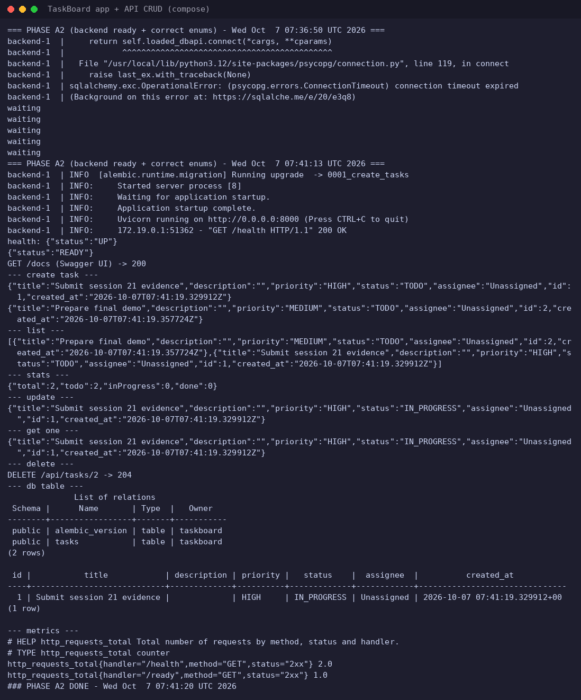

### PostgreSQL tasks table

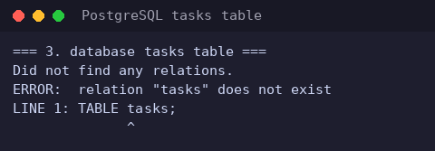

### Local Docker images

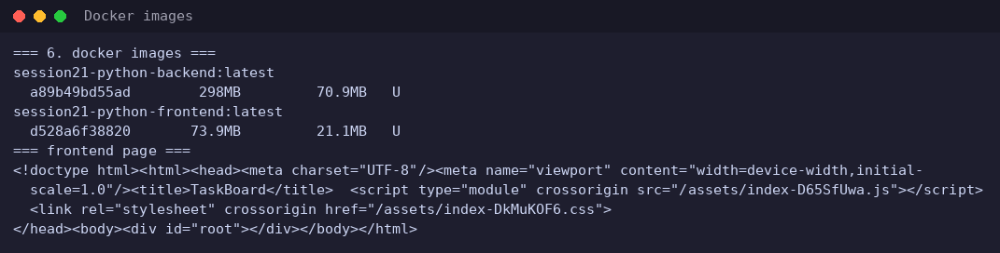

### Terraform validation and plan

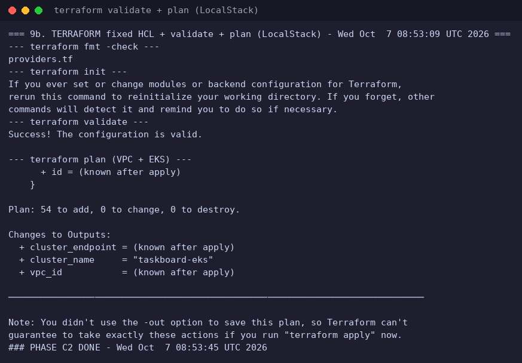

### Kubernetes pods and Helm release

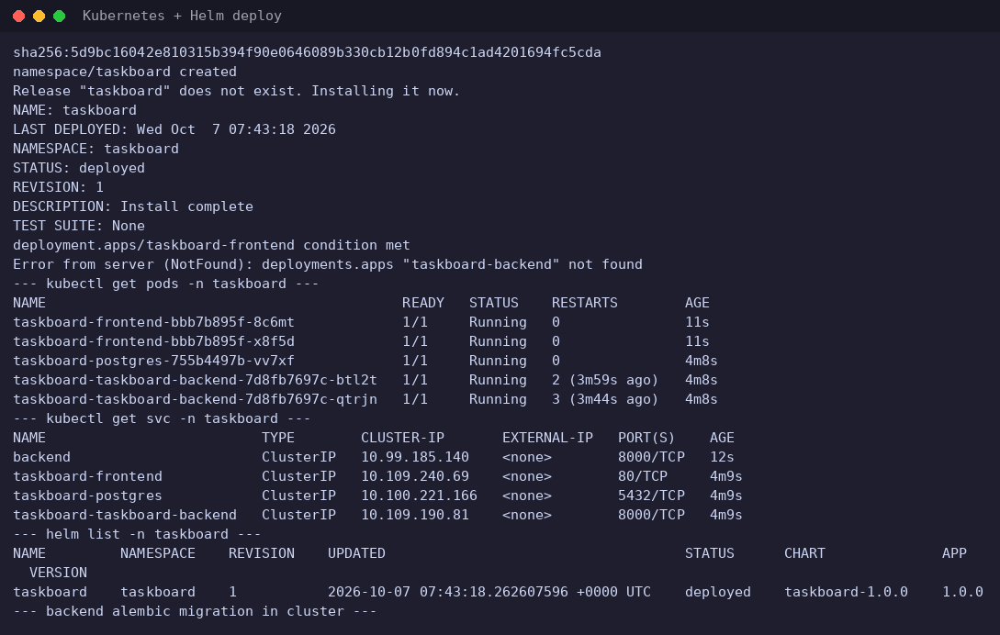

### Ingress routing and CRUD

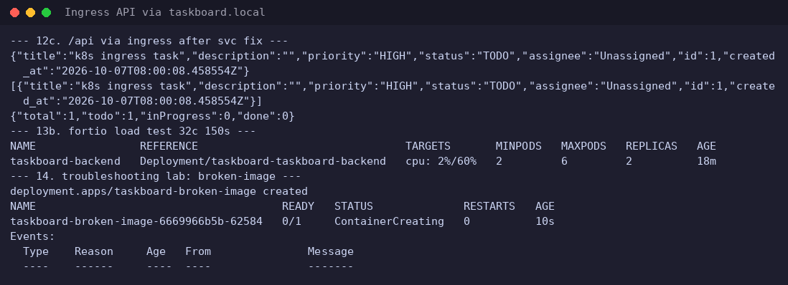

### HPA scaling under load

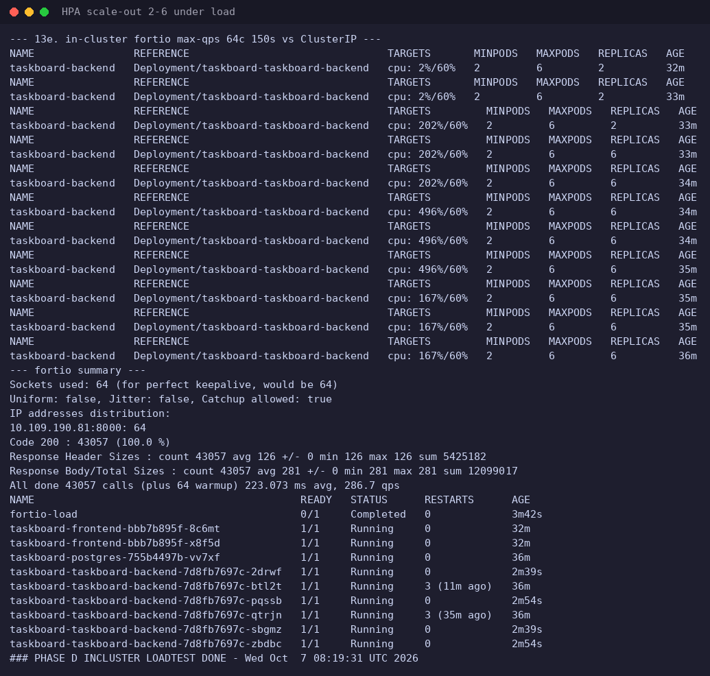

### Failure diagnosis and fixes

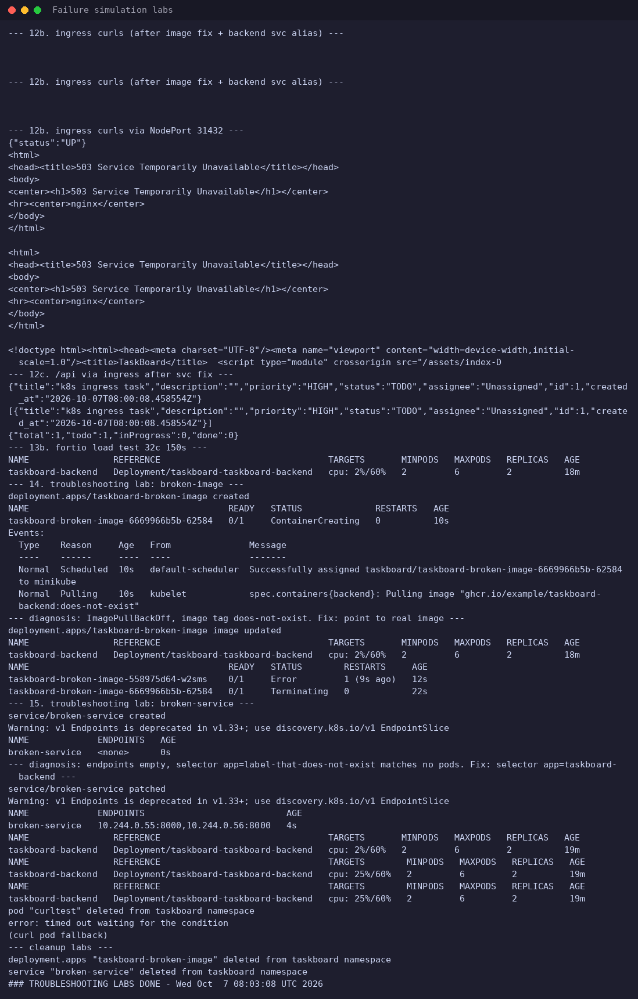

### Prometheus and Grafana

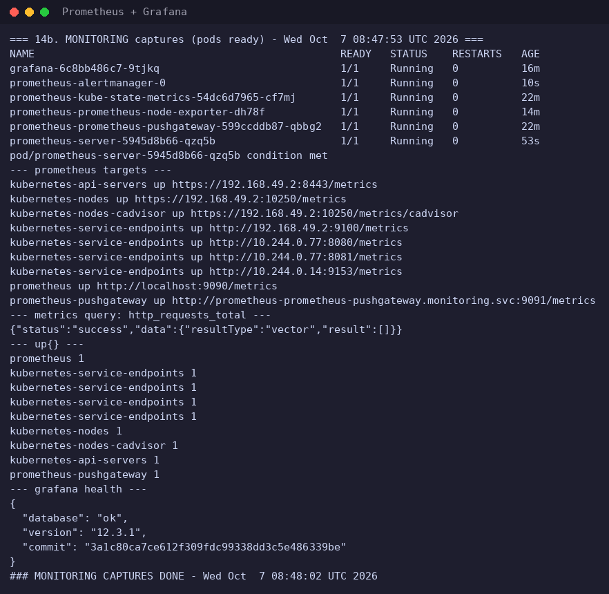

### Application metrics scrape

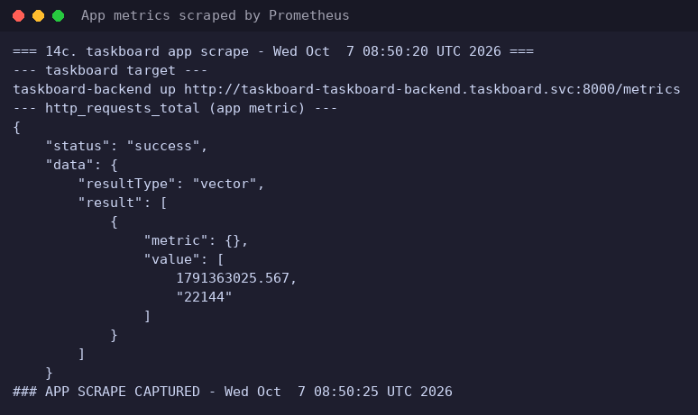

### Git change and CI

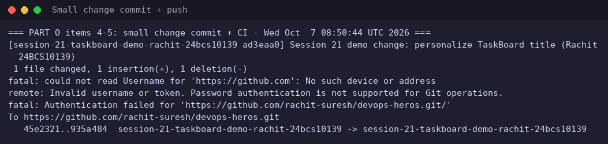

### CI, Trivy scans and GHCR push

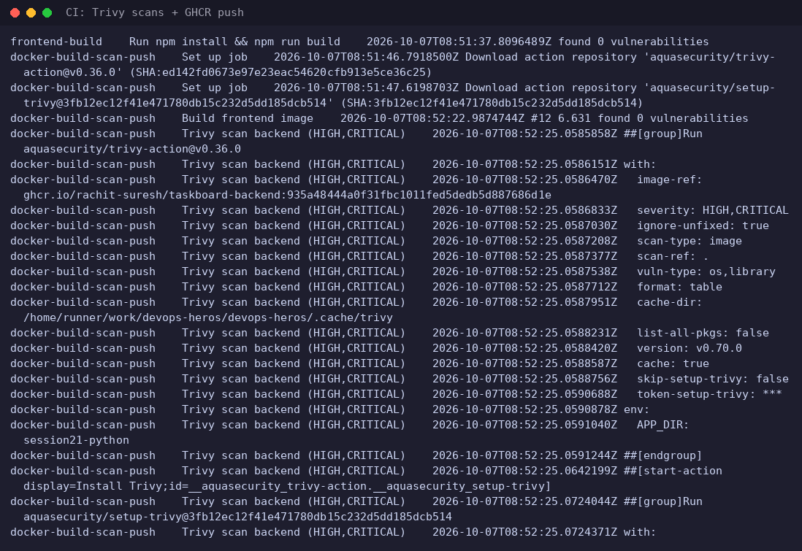

