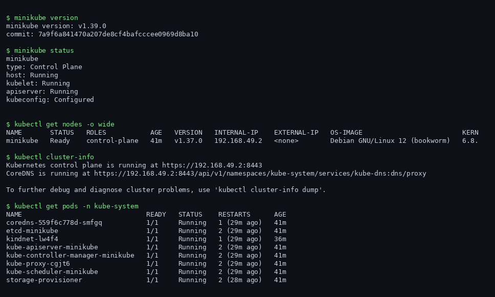
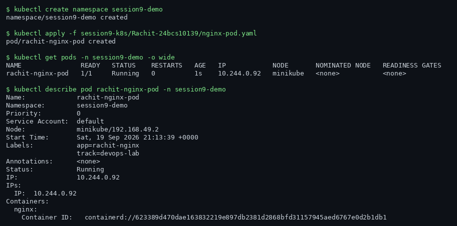
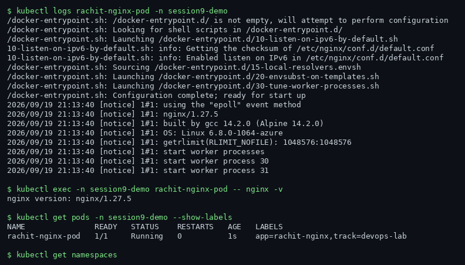
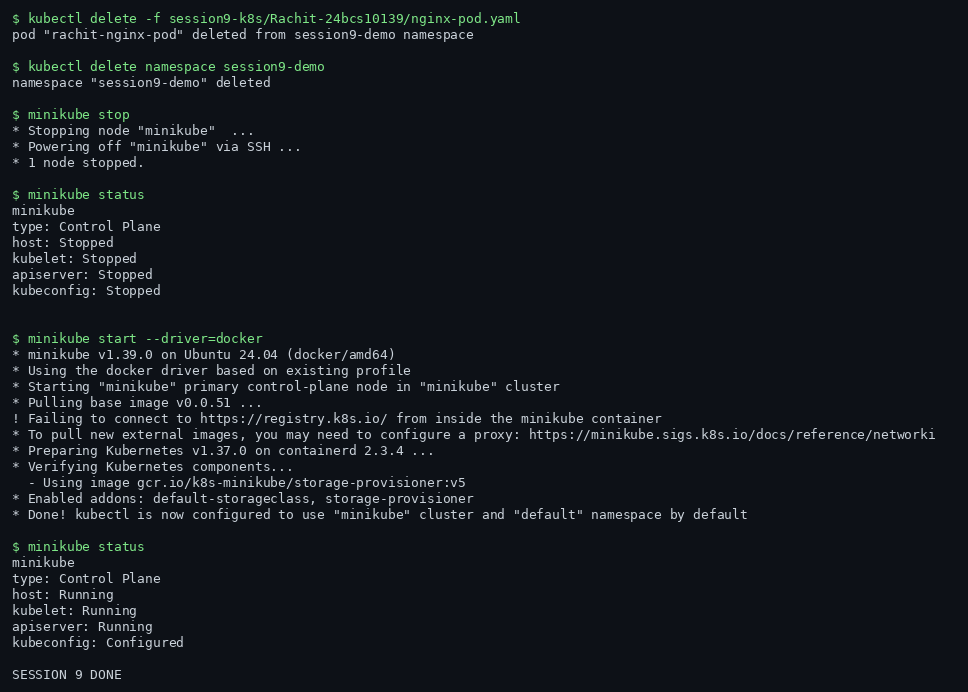

# Session 9 — Kubernetes Fundamentals

**Name:** Rachit S
**Enrollment Number:** 24BCS10139

All commands below were run against a real Kubernetes cluster created with **Minikube v1.39.0
(Kubernetes v1.37.0, docker driver)**. Because my laptop was unavailable, the cluster ran on a
cloud VM (GitHub Codespaces) — every screenshot and output block is the actual output of the
command shown above it, captured from that live cluster.

---

## Task 1: Minikube — install, start, status, stop

Minikube runs a full single-node Kubernetes cluster inside a Docker container. The control plane
and the worker are the same node.

```bash
minikube version
minikube start --driver=docker
minikube status
minikube stop
minikube start --driver=docker
minikube status
```



`status` reports the four health markers of the cluster: the container `host`, the `kubelet`
(the node agent), the `apiserver`, and whether `kubeconfig` points kubectl at this cluster.
`stop` shuts the cluster down without deleting it; the next `start` brings the same cluster back
with its state intact.

---

## Task 2: Cluster architecture

A Kubernetes cluster is two kinds of machines:

- **Control plane** — the brain. `kube-apiserver` is the front door for every request;
  `etcd` is the key-value store holding all cluster state; `kube-scheduler` decides which node
  each new pod lands on; `kube-controller-manager` runs the control loops that keep actual
  state matching desired state.
- **Worker nodes** — run the application pods. Each runs a `kubelet` (manages the containers
  on that node), `kube-proxy` (programs the network rules that make Services work), and a
  container runtime (`containerd` here).

On Minikube all of this lives inside one container, but the same components exist in any
production cluster (EKS, GKE, on-prem) — only who manages the control plane changes.

```bash
kubectl get nodes -o wide
kubectl cluster-info
kubectl get pods -n kube-system
kubectl api-resources --namespaced=false | head -8
```



Notice the control-plane components (`etcd`, `kube-apiserver`, `kube-controller-manager`,
`kube-scheduler`) are themselves pods in `kube-system` — Kubernetes hosts its own brain as
"static pods" managed directly by the kubelet. `kindnet` is the CNI plugin giving pods their
networking, `coredns` provides in-cluster DNS, and `storage-provisioner` backs
PersistentVolumeClaims.

---

## Task 3: Pods — create, inspect, logs

A **Pod** is the smallest deployable unit in Kubernetes: one or more containers sharing a
network namespace and storage, always scheduled together.

`nginx-pod.yaml`:

```yaml
apiVersion: v1
kind: Pod
metadata:
  name: rachit-nginx-pod
  namespace: session9-demo
  labels:
    app: rachit-nginx
    track: devops-lab
spec:
  containers:
    - name: nginx
      image: nginx:1.27-alpine
      ports:
        - containerPort: 80
```

```bash
kubectl create namespace session9-demo
kubectl apply -f nginx-pod.yaml
kubectl get pods -n session9-demo -o wide
kubectl describe pod rachit-nginx-pod -n session9-demo
kubectl logs rachit-nginx-pod -n session9-demo
```



`describe` shows the pod's full detail: which node it landed on, its pod IP, the resolved
image, and the event trail (Scheduled -> Pulled -> Created -> Started). `logs` streams the
container's stdout — nginx's startup messages here.

---

## Task 4: exec, labels, namespaces, cleanup

```bash
kubectl exec -n session9-demo rachit-nginx-pod -- nginx -v
kubectl get pods -n session9-demo --show-labels
kubectl get namespaces
kubectl delete -f nginx-pod.yaml
kubectl delete namespace session9-demo
```



- `kubectl exec` runs a command *inside* a running container — the Kubernetes equivalent of
  `docker exec`, used for quick debugging.
- **Labels** are key-value tags (`app=rachit-nginx`). Services, Deployments and ReplicaSets
  find their pods purely through label selectors — nothing is wired together by name.
- **Namespaces** split one physical cluster into isolated virtual clusters with their own
  objects, RBAC and quotas. `kube-system`, `kube-public`, `kube-node-lease` and `default`
  exist from the start; `session9-demo` was created for this lab and deleted at the end.

---

## Interview-style summary

- **Pod vs container?** A Pod wraps one or more containers that must share a network
  namespace and storage. Kubernetes never schedules a bare container — only Pods.
- **What is etcd?** The cluster's single source of truth. Lose it without a backup and the
  cluster's state is gone even if every node still runs.
- **What does the scheduler decide?** Only *which node* a new pod binds to, based on resource
  requests, affinities/taints and current capacity. The kubelet on that node does the rest.

## Resources

- https://kubernetes.io/docs/tutorials/kubernetes-basics/
- https://minikube.sigs.k8s.io/docs/start/
- https://kubernetes.io/docs/concepts/architecture/
